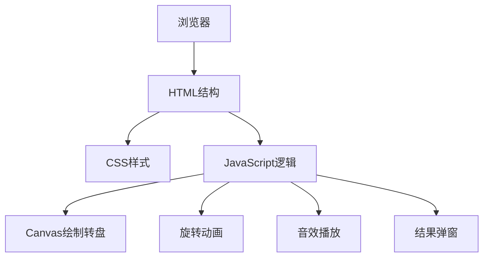

## 1. Architecture Design
单页面应用，采用纯HTML + CSS + JavaScript实现，无需后端服务。



## 2. Technology Description
- Frontend: 纯HTML5 + CSS3 + JavaScript (ES6+)
- 图形绘制: Canvas 2D API
- 动画: CSS transform + transition + JavaScript
- 音效: Web Audio API
- 部署: 静态文件部署

## 3. File Structure
```
/workspace/
├── index.html          # 主页面
├── styles.css          # 样式文件
└── script.js           # JavaScript逻辑
```

## 4. Core Components

### 4.1 Prize Configuration
```javascript
const prizes = [
  { name: '一等奖', color: '#E53935', textColor: '#FFD700' },
  { name: '二等奖', color: '#FFD700', textColor: '#E53935' },
  { name: '三等奖', color: '#E53935', textColor: '#FFD700' },
  { name: '四等奖', color: '#FFD700', textColor: '#E53935' },
  { name: '五等奖', color: '#E53935', textColor: '#FFD700' },
  { name: '幸运奖', color: '#FFD700', textColor: '#E53935' }
];
```

### 4.2 Rotation Logic
- 每次旋转至少5圈（1800度）
- 3秒旋转时间，使用ease-out缓动函数
- 随机确定中奖奖项
- 根据奖项计算最终停止角度

### 4.3 Sound Effects
使用Web Audio API生成简单的音效：
- 开始音效：上升音调
- 中奖音效：欢快的胜利音调

## 5. Responsive Design
- 转盘尺寸基于视口宽度动态计算
- 最大直径限制为350px
- 在小屏幕上适当缩小
- 触摸事件优化
