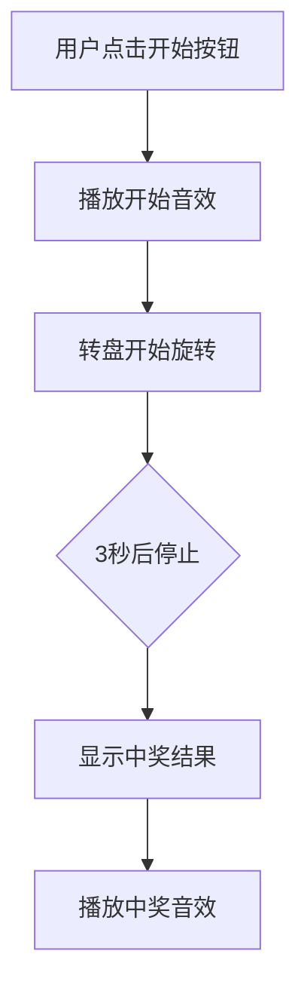

## 1. Product Overview
抽奖转盘是一个用于活动抽奖的互动页面，适合手机扫码使用，采用红色金色喜庆风格，支持6个奖项，具有旋转动画和音效功能。

## 2. Core Features

### 2.1 Feature Module
1. **抽奖主页面**：转盘展示、开始按钮、中奖结果展示、音效播放

### 2.3 Page Details
| Page Name | Module Name | Feature description |
|-----------|-------------|---------------------|
| 抽奖主页面 | 转盘组件 | 圆形转盘分为6个奖项区域（一等奖、二等奖、三等奖、四等奖、五等奖、幸运奖） |
| 抽奖主页面 | 开始按钮 | 转盘中央有开始按钮，点击触发抽奖 |
| 抽奖主页面 | 旋转动画 | 指针旋转3秒后随机停止 |
| 抽奖主页面 | 中奖结果 | 显示中奖信息弹窗 |
| 抽奖主页面 | 音效播放 | 点击开始和中奖时播放音效 |

## 3. Core Process
用户点击开始按钮 → 转盘开始旋转（播放开始音效）→ 3秒后转盘停止 → 显示中奖结果（播放中奖音效）

## 4. User Interface Design
### 4.1 Design Style
- **主色调**：红色（#E53935）、金色（#FFD700）
- **辅助色**：深红色（#C62828）、浅金色（#FFF59D）
- **按钮风格**：圆角按钮，金色边框，红色背景，悬停时有放大效果
- **字体**：使用中文喜庆字体，大号标题，中等字号内容
- **布局风格**：居中布局，转盘为视觉焦点
- **装饰元素**：云纹、灯笼、鞭炮等传统喜庆元素

### 4.2 Page Design Overview
| Page Name | Module Name | UI Elements |
|-----------|-------------|-------------|
| 抽奖主页面 | 转盘 | 6个扇形区域，红色金色交替，带奖项文字，金色边框 |
| 抽奖主页面 | 开始按钮 | 圆形金色按钮，红色文字，悬停放大 |
| 抽奖主页面 | 指针 | 金色指针，顶部有红色装饰 |
| 抽奖主页面 | 结果弹窗 | 红色弹窗，金色边框，带关闭按钮 |
| 抽奖主页面 | 背景 | 渐变红色背景，金色装饰元素 |

### 4.3 Responsiveness
- Mobile-first设计，完全适配手机屏幕
- 触摸优化，按钮大小适合点击
- 响应式布局，适配各种手机尺寸

### 4.4 动画效果
- 转盘旋转：3秒的平滑加速减速动画
- 按钮悬停：轻微放大效果
- 弹窗显示：淡入和缩放动画
