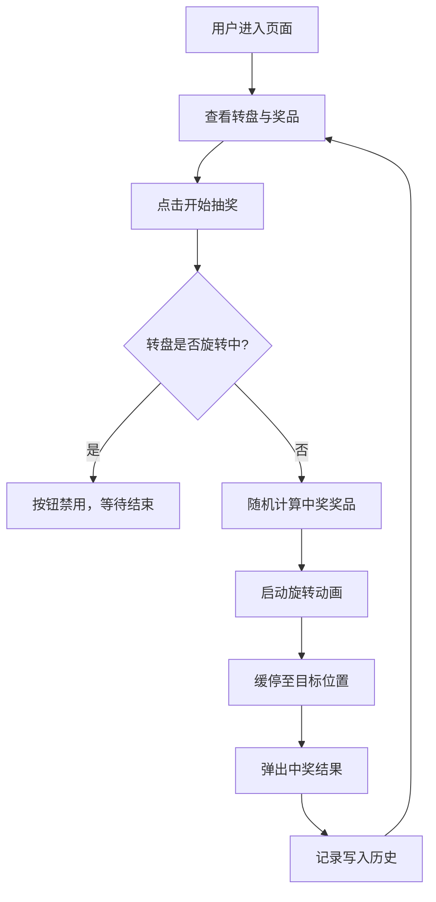

## 1. 产品概述
抽奖转盘是一个纯前端互动抽奖应用，用户点击按钮即可旋转转盘，随机抽取预设奖品。目标用户为活动运营人员和参与抽奖的终端用户，核心价值在于提供视觉精美、交互流畅的抽奖体验。

## 2. 核心功能

### 2.1 用户角色
| 角色 | 注册方式 | 核心权限 |
|------|----------|----------|
| 普通用户 | 无需注册 | 旋转转盘、查看中奖结果、查看抽奖记录 |

### 2.2 功能模块
1. **抽奖主页**：转盘展示区、抽奖按钮、中奖结果弹窗、抽奖记录面板

### 2.3 页面详情
| 页面名称 | 模块名称 | 功能描述 |
|----------|----------|----------|
| 抽奖主页 | 转盘展示区 | 展示带奖品分区的转盘，指针指示中奖位置 |
| 抽奖主页 | 抽奖按钮 | 点击触发转盘旋转动画，旋转期间禁用按钮 |
| 抽奖主页 | 中奖结果弹窗 | 旋转结束后弹出，展示中奖奖品名称和图标，支持关闭 |
| 抽奖主页 | 抽奖记录面板 | 侧边展示历史抽奖记录，包含时间和奖品名称 |
| 抽奖主页 | 奖品配置面板 | 可编辑奖品名称、颜色，支持增删奖品项 |

## 3. 核心流程
用户进入页面 → 查看转盘和奖品列表 → 点击"开始抽奖"按钮 → 转盘旋转动画（3-5秒）→ 缓停至中奖位置 → 弹出中奖结果 → 用户关闭弹窗 → 记录写入历史面板 → 可继续抽奖

## 4. 用户界面设计

### 4.1 设计风格
- 主色调：深红/金色（喜庆风格），辅以暗色背景营造氛围感
- 按钮风格：3D立体圆角按钮，带光泽和阴影
- 字体：标题使用装饰性字体，正文使用清晰无衬线字体
- 布局：居中转盘为主视觉，右侧/下方为记录面板
- 图标/装饰：转盘外圈灯泡闪烁效果，中奖时彩带/粒子特效

### 4.2 页面设计概览
| 页面名称 | 模块名称 | UI 元素 |
|----------|----------|---------|
| 抽奖主页 | 转盘展示区 | 圆形Canvas转盘、扇形分区、外圈灯泡动画、中心指针 |
| 抽奖主页 | 抽奖按钮 | 3D立体金色按钮、hover光泽、点击缩放反馈 |
| 抽奖主页 | 中奖结果弹窗 | 毛玻璃遮罩、居中卡片、奖品图标、关闭按钮、彩带动画 |
| 抽奖主页 | 抽奖记录面板 | 右侧滑出面板、时间+奖品列表、滚动区域 |
| 抽奖主页 | 奖品配置面板 | 底部展开面板、表单输入、颜色选择器、增删按钮 |

### 4.3 响应式设计
- 桌面优先设计，转盘居中展示
- 平板端：转盘缩小，记录面板移至下方
- 移动端：全宽转盘，面板折叠为底部抽屉

### 4.4 动画效果
- 转盘旋转：缓入缓出（ease-out），总时长3-5秒
- 灯泡闪烁：外圈灯泡交替亮灭，频率0.5秒
- 中奖弹窗：缩放弹入 + 彩带粒子飘落
- 按钮：hover光泽扫过、active下沉
