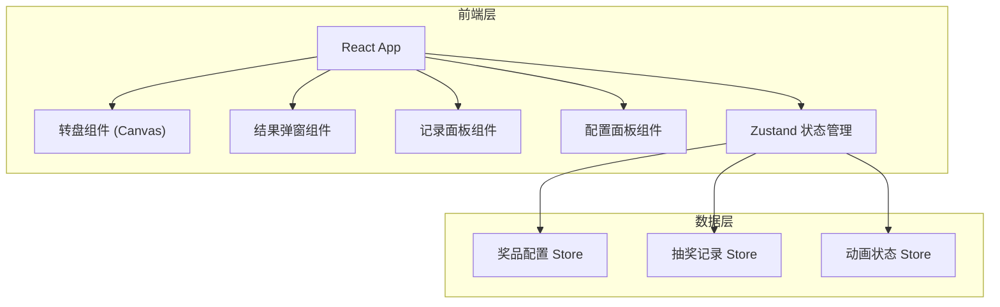
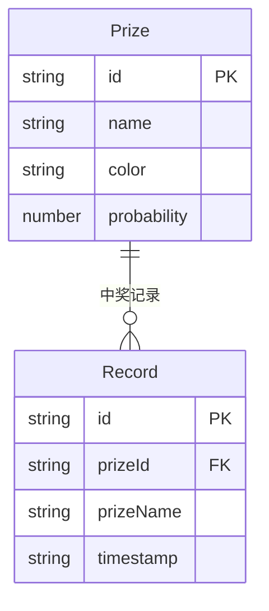

## 1. 架构设计



## 2. 技术说明
- 前端：React@18 + TypeScript + Tailwind CSS@3 + Vite
- 初始化工具：vite-init
- 后端：无（纯前端应用）
- 数据库：无（使用 localStorage 持久化抽奖记录）
- 状态管理：Zustand
- 动画：Canvas 2D API + requestAnimationFrame
- 图标：lucide-react

## 3. 路由定义
| 路由 | 用途 |
|------|------|
| / | 抽奖主页，包含转盘、记录和配置 |

## 4. API 定义
无后端 API，所有数据存储在 localStorage 中。

## 5. 数据模型

### 5.1 数据模型定义



### 5.2 数据定义
```typescript
interface Prize {
  id: string;
  name: string;
  color: string;
  probability: number; // 权重，用于概率计算
}

interface LotteryRecord {
  id: string;
  prizeId: string;
  prizeName: string;
  timestamp: string;
}

interface LotteryState {
  prizes: Prize[];
  records: LotteryRecord[];
  isSpinning: boolean;
  result: Prize | null;
}
```

### 5.3 默认奖品配置
| 奖品名称 | 颜色 | 权重 |
|----------|------|------|
| 一等奖 | #FFD700 | 1 |
| 二等奖 | #FF6B6B | 3 |
| 三等奖 | #4ECDC4 | 5 |
| 幸运奖 | #A8E6CF | 10 |
| 谢谢参与 | #95A5A6 | 30 |
