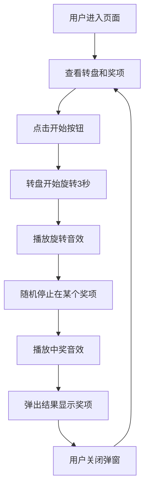

# 抽奖转盘 PRD 产品需求文档

## 1. 产品概述

一个喜庆风格的抽奖转盘页面，用户点击中央开始按钮后，转盘指针旋转3秒后随机停止，显示中奖结果并播放音效。适用于活动现场、年会等场景，红色金色主题营造热闹氛围，适配手机扫码访问。

## 2. 核心功能

### 2.1 功能模块

1. **抽奖转盘**
   - 圆形转盘分为6个等分奖项区域
   - 奖项从一等奖到幸运奖依次排列
   - 转盘带有装饰性边框和纹理

2. **中央开始按钮**
   - 位于转盘正中央
   - 点击触发转盘旋转
   - 旋转过程中按钮禁用

3. **指针**
   - 固定在转盘顶部
   - 指向当前停下的奖项

4. **中奖结果展示**
   - 旋转结束后弹出结果弹窗
   - 显示中奖奖项名称
   - 带有装饰性动画效果

5. **音效反馈**
   - 旋转时的背景音效
   - 停止时的中奖音效

### 2.2 页面详情

| 页面名称 | 模块名称 | 功能描述 |
|---------|---------|---------|
| 抽奖页 | 转盘组件 | 6格奖项转盘，带有金色边框装饰 |
| 抽奖页 | 指针 | 固定顶部指针，三角形金色设计 |
| 抽奖页 | 开始按钮 | 中央圆形按钮，红色背景金色文字 |
| 抽奖页 | 结果弹窗 | 中奖后弹出显示奖项，带关闭按钮 |

## 3. 核心流程

## 4. 用户界面设计

### 4.1 设计风格

- **主题色**: 中国红 `#D4AF37` (金色) 和 `#C41E3A` (中国红)
- **背景色**: 深红色渐变 `#8B0000` → `#C41E3A`
- **按钮样式**: 圆形按钮，带阴影和3D效果
- **字体**: 使用圆润可爱的中文字体
- **装饰元素**: 金色光芒、金色边框、祥云纹理
- **风格**: 喜庆、热烈、节日感

### 4.2 奖项配置

| 奖项 | 名称 | 颜色 |
|-----|------|-----|
| 1 | 一等奖 | 金色 |
| 2 | 二等奖 | 红色 |
| 3 | 三等奖 | 橙色 |
| 4 | 四等奖 | 黄色 |
| 5 | 五等奖 | 绿色 |
| 6 | 幸运奖 | 蓝色 |

### 4.3 响应式设计

- 移动端优先设计
- 转盘尺寸根据屏幕自适应
- 最大宽度 400px
- 触摸操作优化
- 适配手机扫码直接访问
