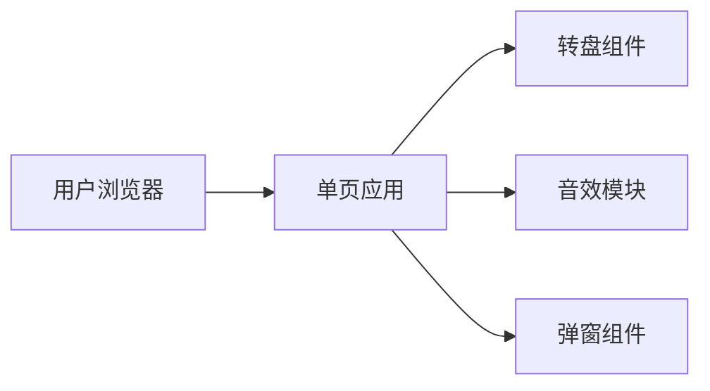

# 抽奖转盘 技术架构文档

## 1. 架构设计



## 2. 技术选型

- **前端框架**: 原生 HTML5 + CSS3 + JavaScript (单文件实现)
- **动画**: CSS3 transform + transition + keyframes
- **音效**: Web Audio API
- **布局**: Flexbox + 响应式设计
- **图标**: CSS绘制的装饰元素和Unicode字符

## 3. 页面路由

| 路由 | 用途 |
|-----|------|
| /index.html | 抽奖主页面 |

## 4. 核心组件

### 4.1 转盘组件 (Wheel)
- 使用 Canvas 或 CSS 实现
- 6个等分扇形区域
- 每个区域不同颜色背景和奖项文字
- 带金色边框装饰

### 4.2 指针组件 (Pointer)
- 固定在转盘顶部中央
- CSS 绘制的三角形
- 金色渐变填充
- 带阴影效果

### 4.3 开始按钮 (StartButton)
- 圆形按钮，位于转盘中央
- 红色背景，金色文字
- hover 状态发光效果
- 点击后禁用状态

### 4.4 结果弹窗 (ResultModal)
- 半透明遮罩层
- 居中卡片显示结果
- 中奖文字 + 装饰动画
- 关闭按钮

### 4.5 音效模块 (AudioManager)
- 旋转音效: 循环播放的嗖嗖声
- 停止音效: 鞭炮/礼花声
- 使用 Audio API 生成简单音效

## 5. 抽奖逻辑

```
1. 点击开始按钮
2. 生成随机角度 (0-360度)
3. 添加额外旋转圈数 (3-5圈)
4. 应用 CSS transition 旋转动画 (3秒)
5. 动画结束后根据角度计算中奖奖项
6. 播放停止音效
7. 显示结果弹窗
```

## 6. 中奖计算

- 转盘分为6个区域，每个区域60度
- 指针固定在顶部(0度位置)
- 最终角度取360度模运算
- 根据角度确定奖项索引
